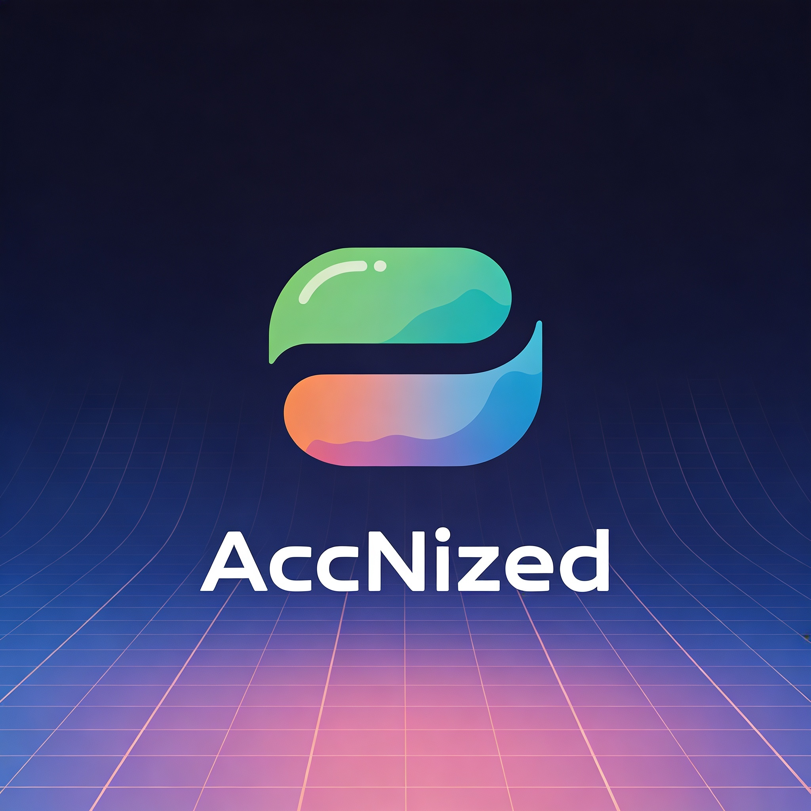

<div align="center">



# AccNized

### Gestor de cuentas personales · Inteligente · Privado · Offline

*Cuentas · Notas · Etiquetas · Privacidad · Personalización*

---


</div>

---

## 🔍 ¿Qué es AccNized?

**AccNized** es una aplicación de escritorio y móvil para organizar tus cuentas digitales de forma segura y completamente **offline**. Sin servidores, sin suscripciones, sin que tus datos salgan de tu dispositivo.

Organiza correos, redes sociales y servicios, añade notas privadas vinculadas a cada cuenta, protege lo sensible con contraseña, y personaliza todo a tu gusto.

---

## ✨ Características principales

| Ícono | Función | Descripción |
|:---:|---|---|
| 🔐 | **Cuentas protegidas** | Contraseña opcional por cuenta. El contenido queda oculto hasta autenticarte |
| 🏷️ | **Etiquetas** | Sistema de etiquetas con colores para clasificar y filtrar cuentas y notas |
| 🔗 | **Usos vinculados** | Registra en qué servicios se usa cada cuenta |
| 🎨 | **Icono personalizado** | Elige entre 30+ iconos para identificar visualmente cada cuenta |
| 📝 | **Notas con estilo** | Editor de notas con color de fondo, color de título, color de contenido y tamaño de fuente |
| 🔒 | **Notas privadas** | Una nota privada solo se ve al entrar a la cuenta vinculada, nunca en la lista pública |
| 🔗 | **Notas ↔ Cuentas** | Vincula notas a una o varias cuentas. Aparecen en el detalle de cada una |
| 🌗 | **Tema claro/oscuro** | Se adapta automáticamente al sistema operativo |
| 💾 | **100% offline** | Base de datos SQLite local. Tus datos nunca salen del dispositivo |

---

## 📱 Capturas de pantalla

> *Pantalla de cuentas · Detalle de cuenta · Editor de notas*

```
┌─────────────────┐  ┌─────────────────┐  ┌─────────────────┐
│  AccNized       │  │ mi@gmail.com    │  │ ● Sin guardar   │
│ ○ Todas  Trabajo│  │ Gmail    🔒     │  │          Guardar│
│                 │  │─────────────────│  │─────────────────│
│ 🎮 polnito      │  │ Etiquetas       │  │ Título de nota  │
│    polno        │  │ ● Importante    │  │─────────────────│
│    🔒 Protegida │  │ ● Personal      │  │ Contenido...    │
│                 │  │─────────────────│  │                 │
│ 📧 mi@gmail.com │  │ Usos (2)    (+) │  │                 │
│    Gmail        │  │ 🔗 se usa en X  │  │                 │
│    ● Personal   │  │ 🔗 Discord      │  │─────────────────│
│    🔗 Discord   │  │─────────────────│  │🎨 T Aa 🏷 🔗 🔒│
└─────────────────┘  └─────────────────┘  └─────────────────┘
```

---

## 🗄️ Base de datos (SQLite local)

```
accounts          → Cuentas (identificador, tipo, icono, contraseña)
  │
  ├── usages      → Usos de cada cuenta (Discord, Twitter, etc.)
  │
  └── account_labels ──┐
                        ├── labels → Etiquetas compartidas (cuentas y notas)
  ┌── note_labels ──────┘
  │
notes             → Notas (fondo, título, contenido, privacidad)
  │
  └── account_notes → Vínculos nota ↔ cuenta (muchos a muchos)
```

---

## 🚀 Instalación

### Requisitos

- Flutter SDK ≥ 3.22 → [flutter.dev](https://flutter.dev/docs/get-started/install)
- **Windows:** Visual Studio 2022/2026 con workload **"Desarrollo para escritorio con C++"**
- **Android:** Android Studio + SDK o dispositivo físico con USB debug

### Pasos

**1. Clonar el repositorio**
```bash
git clone https://github.com/tu-usuario/accnized.git
cd accnized
```

**2. Instalar dependencias**
```bash
flutter pub get
```

**3. Ejecutar en Windows**
```bash
flutter run -d windows
```

**4. Ejecutar en Android**
```bash
flutter run -d android
```

---

## 📦 Compilar para distribución

**APK para Android**
```bash
flutter build apk --release
# → build/app/outputs/flutter-apk/app-release.apk
```

**Ejecutable Windows**
```bash
flutter build windows --release
# → build/windows/x64/runner/Release/accnized.exe
```

---

## 📁 Estructura del proyecto

```
accnized/
│
├── 📁 lib/
│   ├── main.dart                        # Entrada, tema M3, navegación
│   │
│   ├── 📁 models/
│   │   ├── account.dart                 # Cuenta con icono y contraseña
│   │   ├── usage.dart                   # Uso vinculado a cuenta
│   │   ├── label.dart                   # Etiqueta con color
│   │   └── note.dart                    # Nota con colores y privacidad
│   │
│   ├── 📁 database/
│   │   └── database_helper.dart         # CRUD SQLite + migraciones
│   │
│   ├── 📁 screens/
│   │   ├── home_screen.dart             # Lista de cuentas + filtros
│   │   ├── account_detail_screen.dart   # Detalle + gate de contraseña
│   │   ├── account_form_screen.dart     # Crear / editar cuenta
│   │   ├── labels_screen.dart           # Gestión de etiquetas
│   │   ├── notes_screen.dart            # Grid de notas públicas
│   │   └── note_editor_screen.dart      # Editor completo de notas
│   │
│   ├── 📁 widgets/
│   │   ├── account_card.dart            # Tarjeta de cuenta
│   │   ├── label_chip.dart              # Chip de etiqueta
│   │   └── icon_picker_dialog.dart      # Selector de icono
│   │
│   └── 📁 utils/
│       └── account_icons.dart           # Mapa de 30+ iconos
│
├── pubspec.yaml
├── .gitignore
└── README.md
```

---

## 🔒 Privacidad y seguridad

- **Sin internet:** AccNized no hace ninguna petición de red. Todo es local.
- **Contraseña por cuenta:** Al entrar a una cuenta protegida se pide la clave. El contenido queda invisible en la lista principal.
- **Notas privadas:** Marcando una nota como privada, desaparece de la pantalla "Notas" y solo es visible dentro de la cuenta vinculada (que puede tener su propia contraseña).
- **Sin analytics:** No hay telemetría, rastreo ni recolección de datos de ningún tipo.

> ⚠️ Las contraseñas se guardan en texto plano en la base de datos local. Para mayor seguridad, cifra el disco de tu dispositivo.

---

## 🧩 Dependencias

| Paquete | Versión | Uso |
|---|---|---|
| `sqflite` | ^2.3.3 | Base de datos SQLite (Android) |
| `sqflite_common_ffi` | ^2.3.4 | SQLite para Windows/Linux |
| `path_provider` | ^2.1.3 | Ruta de la base de datos |
| `path` | ^1.9.0 | Manejo de rutas de archivos |
| `intl` | ^0.19.0 | Formato de fechas |
| `uuid` | ^4.4.2 | Identificadores únicos |

## ⬇️ Instalación para usuarios finales

> No necesitas instalar Flutter ni ningún entorno de desarrollo. Solo descarga y ejecuta.

### 🖥️ Windows

1. Ve a [**Releases**](https://github.com/tu-usuario/accnized/releases) y descarga `AccNized-vX.X.X-windows.zip`
2. Descomprime la carpeta en cualquier lugar (Escritorio, Documentos, etc.)
3. Abre la carpeta y haz doble clic en **`accnized.exe`**

> ⚠️ Si Windows muestra *"aplicación desconocida"*, haz clic en **"Más información" → "Ejecutar de todas formas"**. La app no tiene firma de código por ahora.

---

### 📱 Android

1. Ve a [**Releases**](https://github.com/tu-usuario/accnized/releases) y descarga `AccNized-vX.X.X.apk`
2. Ábrelo desde tu carpeta de Descargas
3. Si Android pide permiso para instalar apps desconocidas:
   - **Android 8+:** Ajustes → Aplicaciones → tu navegador/gestor de archivos → *Instalar apps desconocidas* → Permitir
   - **Android 7 o menos:** Ajustes → Seguridad → *Fuentes desconocidas* → Activar
4. Toca **Instalar** y listo

> ⚠️ AccNized no está en Google Play. Es normal que Android advierta sobre el origen — la app no hace conexiones de red ni recolecta datos.

---

> 💡 **¿Primera vez?** No hace falta crear cuenta ni configurar nada. Al abrirla por primera vez ya puedes empezar a añadir tus cuentas.

<div align="center">

Construido con 💙 en Flutter · Datos 100% tuyos

</div>
